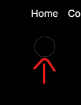

This is a [Next.js](https://nextjs.org/) project bootstrapped with [`create-next-app`](https://github.com/vercel/next.js/tree/canary/packages/create-next-app).

## Getting Started

First, run the development server:

```bash
npm run dev
# or
yarn dev
# or
pnpm dev
# or
bun dev
```

Open [http://localhost:3000](http://localhost:3000) with your browser to see the result.

You can start editing the page by modifying `app/page.tsx`. The page auto-updates as you edit the file.

This project uses [`next/font`](https://nextjs.org/docs/basic-features/font-optimization) to automatically optimize and load Inter, a custom Google Font.

## Learn More

To learn more about Next.js, take a look at the following resources:

- [Next.js Documentation](https://nextjs.org/docs) - learn about Next.js features and API.
- [Learn Next.js](https://nextjs.org/learn) - an interactive Next.js tutorial.

You can check out [the Next.js GitHub repository](https://github.com/vercel/next.js/) - your feedback and contributions are welcome!

## Deploy on Vercel

The easiest way to deploy your Next.js app is to use the [Vercel Platform](https://vercel.com/new?utm_medium=default-template&filter=next.js&utm_source=create-next-app&utm_campaign=create-next-app-readme) from the creators of Next.js.

Check out our [Next.js deployment documentation](https://nextjs.org/docs/deployment) for more details.

<!-- Personal -->

import Navbar from "@/components/Navbar"
@ means preferenece to global directory

<!-- Use aceternity library -->

https://ui.aceternity.com/docs/add-utilities

npm i framer-motion clsx tailwind-merge

<!-- After that create folder name like utils in your src folder and add file cn.ts in that folder-->

Add util file
utils/cn.ts

<!-- For add navbar  -->

https://ui.aceternity.com/components/navbar-menu

<!-- 'use client' in next js -->

In next js we use this for dom manipulation and use react hooks without mentioning on top this 'use client' we cannot use like above both things.

<!-- for dark mode in tailwind -->

add this before theme darkMode: 'class',
and add className in main layout file in html tag like this:

<html lang="en" className="dark">

<!-- Fix menu hover on dropdown -->



To remove this circle on no dropdown item we set condition for children on line 41 in motion div like this:

add this children &&
<motion.div
{active === item && children && (
</motion.div>

<!-- Hero Section -->
<!-- Add spotlight effect  -->

https://ui.aceternity.com/components/spotlight

add given instruction on above link after that we see error on opacity property error would be like type number or string just make number type to string bu adding '0' instead of 0

After that go to spotlight code and copy only spotlight tag and paste it where you want to add spotlight.

<!-- Add moving border -->

https://ui.aceternity.com/components/moving-border

if moving border not working add additional steps got to this url:
https://gist.github.com/hiteshchoudhary

<!-- Copy paste this code in your tailwind config top -->

const colors = require("tailwindcss/colors");
const {
default: flattenColorPalette,
} = require("tailwindcss/lib/util/flattenColorPalette");

// Plugin to add each Tailwind color as a global CSS variable
function addVariablesForColors({ addBase, theme }: any) {
const allColors = flattenColorPalette(theme('colors'));
const newVars = Object.fromEntries(
Object.entries(allColors).map(([key, value]) => [`--${key}`, value])
);

addBase({
':root': newVars,
});

<!-- Card Section -->
<!-- BG Gradient -->

https://ui.aceternity.com/components/background-gradient

<!-- Sticky Scroll Reveal -->

https://ui.aceternity.com/components/sticky-scroll-reveal

<!-- Grid Background and Infinite Moving Cards -->

https://ui.aceternity.com/components/infinite-moving-cards

<!-- Grid BG -->

https://ui.aceternity.com/components/grid-and-dot-backgrounds

setup additional changes in tailwind config file

<!-- Card Hover Effect Section -->

https://ui.aceternity.com/components/card-hover-effect

<!-- Animated Tooltip and Wavy Background -->

https://ui.aceternity.com/components/animated-tooltip
https://ui.aceternity.com/components/wavy-background

<!-- For handling error of api images or unsplash -->

Edit nextjs config file:

/\*_ @type {import('next').NextConfig} _/
const nextConfig = {
images: {
domains: ['images.unsplash.com', 'res.cloudinary.com']
}
};

export default nextConfig;

<!-- 3D Card Effect -->

https://ui.aceternity.com/components/3d-card-effect

<!-- Contact Page Meteor Effect -->

https://ui.aceternity.com/components/meteors

<!-- Background Beams Contact Page -->
https://ui.aceternity.com/components/background-beams
